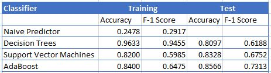
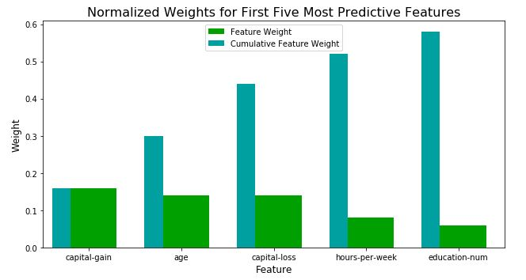

# Finding Donors for CharityML Project

## Introduction

This project is part of The [Udacity](https://eu.udacity.com/) Data Scientist Nanodegree Program which is composed by:
* Term 1
    * Supervised Learning
    * Deep Learning
    * Unsupervised Learning
* Term 2
    * Write A Data Science Blog Post
    * Disaster Response Pipelines
    * Recommendation Engines
    
The goal of this project is to apply Supervised learning techniques on data collected for the U.S. census to help CharityML (a fictitious charity organization) to identify people most likely to donate to their cause. From Udacity a template code was provided in the `finding_donors.ipynb` notebook and the `visuals.py` module which is some out-of-the-box code needed for visualizations. 

## Software and Libraries

This project uses Python 3.7.2 and the following libraries:

- [NumPy](http://www.numpy.org/)
- [Pandas](http://pandas.pydata.org)
- [matplotlib](http://matplotlib.org/)
- [scikit-learn](http://scikit-learn.org/stable/)

More informations in `requirements.txt`. To create it I have used `python -m pip freeze > requirements.txt`. To install all Python packages written in the requirements.txt file run `pip install -r requirements.txt`.

## Data

The modified census dataset consists of approximately 32,000 data points, with each datapoint having 13 features. This dataset is a modified version of the dataset published in the paper *"Scaling Up the Accuracy of Naive-Bayes Classifiers: a Decision-Tree Hybrid",* by Ron Kohavi. You may find this paper [online](https://www.aaai.org/Papers/KDD/1996/KDD96-033.pdf), with the original dataset hosted on [UCI](https://archive.ics.uci.edu/ml/datasets/Census+Income).

* **census.csv**: census dataset

### Features
- `age`: Age
- `workclass`: Working Class (Private, Self-emp-not-inc, Self-emp-inc, Federal-gov, Local-gov, State-gov, Without-pay, Never-worked)
- `education_level`: Level of Education (Bachelors, Some-college, 11th, HS-grad, Prof-school, Assoc-acdm, Assoc-voc, 9th, 7th-8th, 12th, Masters, 1st-4th, 10th, Doctorate, 5th-6th, Preschool)
- `education-num`: Number of educational years completed
- `marital-status`: Marital status (Married-civ-spouse, Divorced, Never-married, Separated, Widowed, Married-spouse-absent, Married-AF-spouse)
- `occupation`: Work Occupation (Tech-support, Craft-repair, Other-service, Sales, Exec-managerial, Prof-specialty, Handlers-cleaners, Machine-op-inspct, Adm-clerical, Farming-fishing, Transport-moving, Priv-house-serv, Protective-serv, Armed-Forces)
- `relationship`: Relationship Status (Wife, Own-child, Husband, Not-in-family, Other-relative, Unmarried)
- `race`: Race (White, Asian-Pac-Islander, Amer-Indian-Eskimo, Other, Black)
- `sex`: Sex (Female, Male)
- `capital-gain`: Monetary Capital Gains
- `capital-loss`: Monetary Capital Losses
- `hours-per-week`: Average Hours Per Week Worked
- `native-country`: Native Country (United-States, Cambodia, England, Puerto-Rico, Canada, Germany, Outlying-US(Guam-USVI-etc), India, Japan, Greece, South, China, Cuba, Iran, Honduras, Philippines, Italy, Poland, Jamaica, Vietnam, Mexico, Portugal, Ireland, France, Dominican-Republic, Laos, Ecuador, Taiwan, Haiti, Columbia, Hungary, Guatemala, Nicaragua, Scotland, Thailand, Yugoslavia, El-Salvador, Trinadad&Tobago, Peru, Hong, Holand-Netherlands)

### Target Variable
- `income`: Income Class (<=50K, >50K)

## Running the code

The code is provided in the [Jupyter Notebook](http://ipython.org/notebook.html) _finding_donors.ipynb_
If you donwload it simply run the command `jupyter notebook finding_donors.ipynb` in the folder were the file is located.
To convert in HTML format the notebook run `jupyter nbconvert finding_donors.ipynb`.

## Results

Results are better explained in this [blog post](https://medium.com/@simone.rigoni01/) but just to summarize:

I have compared the results of three models:
- **Decision Trees**
- **Support Vector Machines**
- **AdaBoost**

Becasue the dataset is pretty imbalanced to evaluate the resutls I have used **F-1 Score**. As explained wonderfully in this [post](http://www.davidsbatista.net/blog/2018/08/19/NLP_Metrics/) **Accurcay** is not indicated for imbalanced dataset.

**AdaBoost** has the best **F-1 Score** and using **GridSearchCV** I have tuned the model improving furthermore the performances

Finally I have extracted the feature importance:

## Licensing and Acknowledgements

Thanks Udacity [Udacity](https://eu.udacity.com/) for the dataset
