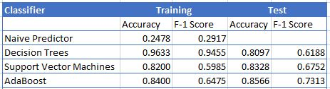
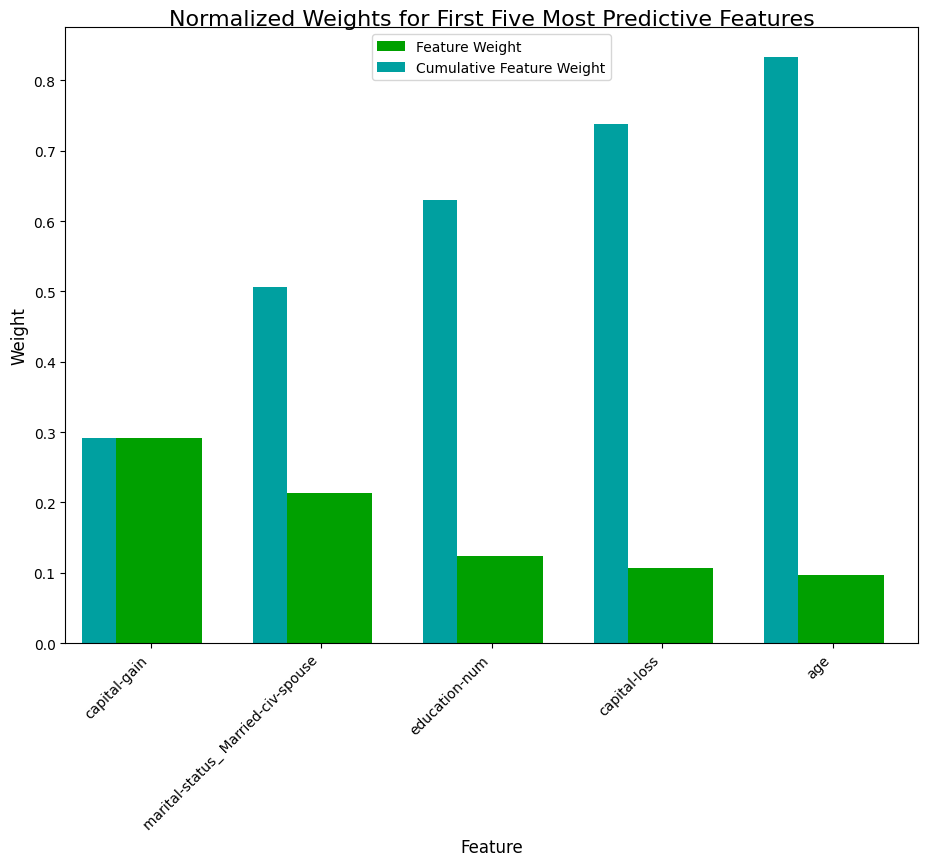

# Finding Donors for CharityML Project

## Introduction

This project is part of The [Udacity](https://eu.udacity.com/) Data Scientist Nanodegree Program which is composed by:
* Term 1
    * Supervised Learning
    * Deep Learning
    * Unsupervised Learning
* Term 2
    * Write A Data Science Blog Post
    * Disaster Response Pipelines
    * Recommendation Engines
    
The goal of this project is to apply Supervised learning techniques on data collected for the U.S. census to help CharityML (a fictitious charity organization) to identify people most likely to donate to their cause. From Udacity a template code was provided in the `finding_donors.ipynb` notebook and the `visuals.py` module which is some out-of-the-box code needed for visualizations. 

## Software and libraries

This project uses Python 3.10.4 and the most important packages are:

- [NumPy](http://www.numpy.org/)
- [Pandas](http://pandas.pydata.org)
- [matplotlib](http://matplotlib.org/)
- [scikit-learn](http://scikit-learn.org/stable/)

To create the virtual enviroment you can run `python -m venv .venv`.

More informations in `requirements.txt`. I am providing a simplified version of the file and letting pip handle the dependencies to avoid maintenance overhead.

To create a complete requirements file you can run `pip freeze > requirements.txt` and to install all python packages in it you can run `pip install -r requirements.txt`.

## Data

The modified census dataset consists of approximately 32,000 data points, with each datapoint having 13 features. This dataset is a modified version of the dataset published in the paper *"Scaling Up the Accuracy of Naive-Bayes Classifiers: a Decision-Tree Hybrid",* by Ron Kohavi. You may find this paper [online](https://www.aaai.org/Papers/KDD/1996/KDD96-033.pdf), with the original dataset hosted on [UCI](https://archive.ics.uci.edu/ml/datasets/Census+Income).

* **census.csv**: census dataset

### Features

- `age`: Age
- `workclass`: Working Class (Private, Self-emp-not-inc, Self-emp-inc, Federal-gov, Local-gov, State-gov, Without-pay, Never-worked)
- `education_level`: Level of Education (Bachelors, Some-college, 11th, HS-grad, Prof-school, Assoc-acdm, Assoc-voc, 9th, 7th-8th, 12th, Masters, 1st-4th, 10th, Doctorate, 5th-6th, Preschool)
- `education-num`: Number of educational years completed
- `marital-status`: Marital status (Married-civ-spouse, Divorced, Never-married, Separated, Widowed, Married-spouse-absent, Married-AF-spouse)
- `occupation`: Work Occupation (Tech-support, Craft-repair, Other-service, Sales, Exec-managerial, Prof-specialty, Handlers-cleaners, Machine-op-inspct, Adm-clerical, Farming-fishing, Transport-moving, Priv-house-serv, Protective-serv, Armed-Forces)
- `relationship`: Relationship Status (Wife, Own-child, Husband, Not-in-family, Other-relative, Unmarried)
- `race`: Race (White, Asian-Pac-Islander, Amer-Indian-Eskimo, Other, Black)
- `sex`: Sex (Female, Male)
- `capital-gain`: Monetary Capital Gains
- `capital-loss`: Monetary Capital Losses
- `hours-per-week`: Average Hours Per Week Worked
- `native-country`: Native Country (United-States, Cambodia, England, Puerto-Rico, Canada, Germany, Outlying-US(Guam-USVI-etc), India, Japan, Greece, South, China, Cuba, Iran, Honduras, Philippines, Italy, Poland, Jamaica, Vietnam, Mexico, Portugal, Ireland, France, Dominican-Republic, Laos, Ecuador, Taiwan, Haiti, Columbia, Hungary, Guatemala, Nicaragua, Scotland, Thailand, Yugoslavia, El-Salvador, Trinadad&Tobago, Peru, Hong, Holand-Netherlands)

### Target variable

- `income`: Income Class (<=50K, >50K)

## Workflow

The code is provided in the [Jupyter Notebook](http://ipython.org/notebook.html) _finding_donors.ipynb_. It will read the data from `DATA_FOLDER` and step by step explore the data, train 3 models and compare their performances.

## Testing

From the project folder run `pytest`

To run a single test: `pytest .\tests\test_configuration.py::test_create_folders`

## PEP8

[PEP8](https://peps.python.org/pep-0008/) is the style guide for Python code, and it's good practice to follow it to ensure your code is readable and consistent.

To check and format my code according to PEP8 I am using:
- [pycodestyle](https://pypi.org/project/pycodestyle/): tool to check the code against PEP 8 conventions.
- [autopep8](https://pypi.org/project/autopep8/): tool to automatically format Python code according to PEP 8 standards.

To run pycodestyle on all files in the project folder and create a report: `pycodestyle --statistics --count . > pycodestyle/report.txt`

To run autopep8 on all files in the project folder: `autopep8 --recursive --in-place .`

I prefere to check and update one file at the time because the previous recursive commands affect also `.venv\` files. For example:

`pycodestyle .\configuration.py > .\pycodestyle\configuration_report.txt`

`autopep8 --in-place .\configuration.py`

Check out `.\pycodestyle\format_and_lint.cmd`

## Running the code

You can open _finding_donors.ipynb_ and run each cell and check their results.

You can also run the command `jupyter notebook finding_donors.ipynb`.

To convert the notebook in HTML format run `jupyter nbconvert finding_donors.ipynb`.

## Results

I have compared the results of three models:

- **Decision Trees**
- **Support Vector Machines**
- **AdaBoost**

Becasue the dataset is pretty imbalanced to evaluate the resutls I have used **F-1 Score**. As explained wonderfully in this [post](http://www.davidsbatista.net/blog/2018/08/19/NLP_Metrics/) **Accurcay** is not indicated for imbalanced dataset.

**AdaBoost** has the best **F-1 Score** and using **GridSearchCV** I have tuned the model improving furthermore the performances

Finally I have extracted the feature importance:

## List of activities

In the [TODO](TODO.md) file you can find the list of tasks and on going activities.

## Licensing and acknowledgements

Thanks Udacity [Udacity](https://eu.udacity.com/) for the dataset.

## Outro

I hope this repository was interesting and thank you for taking the time to check it out. On my Medium you can find a more in depth [story](https://medium.com/@simone-rigoni01/finding-donors-for-charityml-project-e0f4a59dcea0) and on my Blogspot you can find the same [post](https://simonerigoni01.blogspot.com) in italian. Let me know if you have any question and if you like the content that I create feel free to [buy me a coffee](https://www.buymeacoffee.com/simonerigoni).
