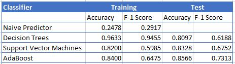
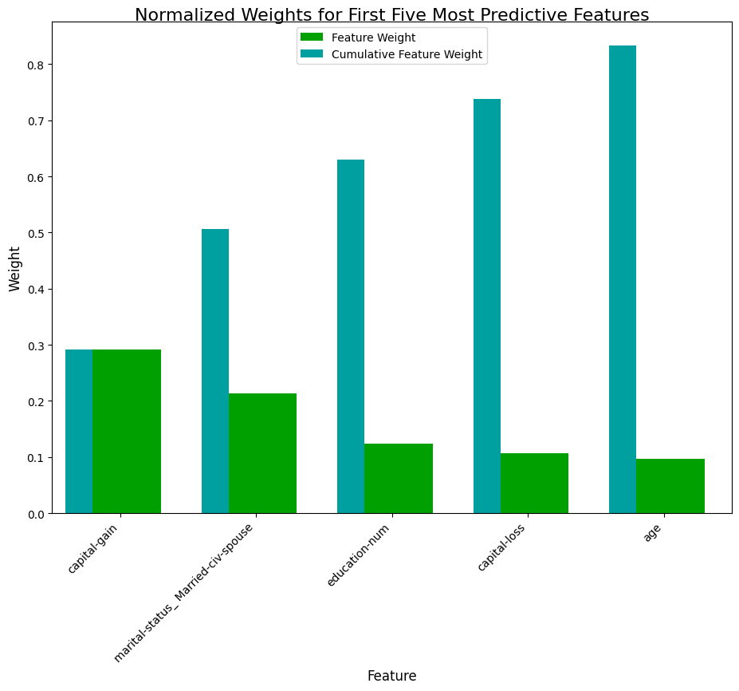

# Finding Donors for CharityML Project

## Introduction

This project is part of The [Udacity](https://eu.udacity.com/) Data Scientist Nanodegree Program which is composed by:

* Term 1
    * Supervised Learning
    * Deep Learning
    * Unsupervised Learning
* Term 2
    * Write A Data Science Blog Post
    * Disaster Response Pipelines
    * Recommendation Engines
    
The goal of this project is to apply Supervised learning techniques on data collected for the U.S. census to help CharityML (a fictitious charity organization) to identify people most likely to donate to their cause. From Udacity a template code was provided in the `finding_donors.ipynb` notebook and the `visuals.py` module which is some out-of-the-box code needed for visualizations. 

## Software and libraries

This project uses Python 3.11 and the most important packages are:

- [NumPy](https://www.numpy.org/)
- [Pandas](https://pandas.pydata.org)
- [matplotlib](https://matplotlib.org/)
- [scikit-learn](https://scikit-learn.org/stable/)

## Data

Have a look at the `data` folder and its [DATA.md](data/DATA.md) file.

## Local configuration

To setup a new local enviroment and install all dependencies you can run `.\my_scripts\Set-Up.ps1`. It will install:

* [Python](https://www.python.org/)
* [uv](https://docs.astral.sh/uv/)
* [Pre-commit](https://pre-commit.com/)

## Code Quality

Code quality is maintained through automated checks and linting using pre-commit.

Pre-commit is a framework for managing and maintaining multi-language pre-commit hooks. A pre-commit hook is a script that runs before a commit operation in a version control system. This allows to shift left code quality checks and remediations. You can change the hooks by updateing the file `.pre-commit-config.yaml`.

To trigger the pre-commit hooks without an actual commit you can run `pre-commit run --all-files -v`.

It is also possible to run manully the individual tools:

- `uv run ruff check --fix`
- `uv run ruff format .`
- `uv run pyright .`

## Testing

Tests are implemented using `pytest` and coverage is tracked with `pytest-cov`. The detailed coverage report is genarated by the pre-commit hook and it is available in [COVERAGE.md](COVERAGE.md) file.

It is also possible to run manully the individual tests:

- `uv run pytest`
- `uv run pytest tests/test_dummy.py::test_dummy`

## Running the code

The code is provided in the [Jupyter Notebook](http://ipython.org/notebook.html) _finding_donors.ipynb_. It will read the data from `DATA_FOLDER` and step by step explore the data, train 3 models and compare their performances.

You can open _finding_donors.ipynb_ and run each cell and check their results.

You can also run the command `ipython -c "%run finding_donors.ipynb"`.

To convert the notebook in HTML format run `jupyter nbconvert finding_donors.ipynb --to html`.

## Results

I have compared the results of three models:

- **Decision Trees**
- **Support Vector Machines**
- **AdaBoost**

Becasue the dataset is pretty imbalanced to evaluate the resutls I have used **F-1 Score**. As explained wonderfully in this [post](http://www.davidsbatista.net/blog/2018/08/19/NLP_Metrics/) **Accurcay** is not indicated for imbalanced dataset.

**AdaBoost** has the best **F-1 Score** and using **GridSearchCV** I have tuned the model improving furthermore the performances

Finally I have extracted the feature importance:

## List of activities

In the [TODO.md](TODO.md) file you can find the list of tasks and on going activities.

## Licensing and acknowledgements

Have a look at [LICENSE.md](LICENSE.md) and many thanks to [Udacity](https://eu.udacity.com/) for the dataset.

## Outro

I hope this repository was interesting and thank you for taking the time to check it out. On my Medium you can find a more in depth [story](https://medium.com/@simone-rigoni01/finding-donors-for-charityml-project-e0f4a59dcea0) and on my Blogspot you can find the same [post](https://simonerigoni01.blogspot.com/2024/05/ricerca-di-donatori-per-il-progetto.html) in italian. Let me know if you have any question and if you like the content that I create feel free to [buy me a coffee](https://www.buymeacoffee.com/simonerigoni).
